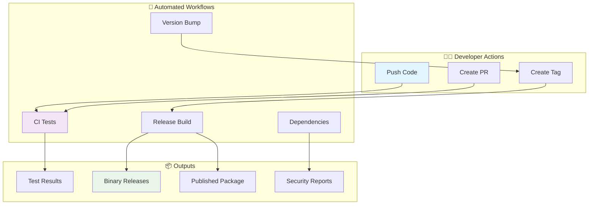
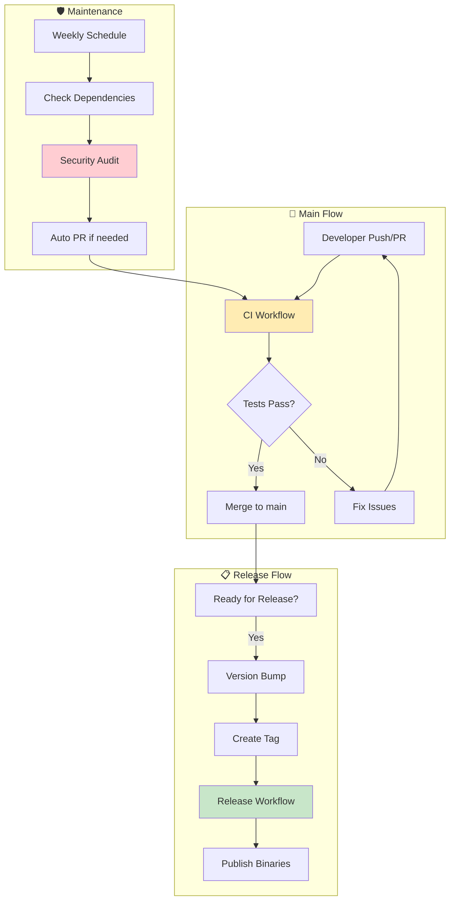

# GitHub Actions Workflow Summary

## 🎯 Quick Overview



## 🔄 Workflow Interaction Map



## ⚡ Quick Reference

| Workflow | Trigger | Duration | Purpose |
|----------|---------|----------|---------|
| **CI** | Push/PR | ~10 min | Code quality, tests, cross-platform |
| **Release** | Git tag | ~25 min | Build binaries, publish, create release |
| **Version Bump** | Manual | ~3 min | Semantic versioning, tag creation |
| **Dependencies** | Weekly | ~8 min | Update deps, security audit |

## 🎛️ Manual Controls

### Version Bumping
```bash
# Go to Actions → Version Bump → Run workflow
# Choose: patch (1.0.0 → 1.0.1)
#         minor (1.0.0 → 1.1.0)  
#         major (1.0.0 → 2.0.0)
```

### Manual Release
```bash
# Go to Actions → Release → Run workflow
# Enter version: v1.2.3
```

### Force Dependency Check
```bash
# Go to Actions → Dependencies → Run workflow
```

## 🔧 Build Matrix

The release workflow builds for **5 platforms**:

```
┌─────────────────────────────────────┐
│  🐧 Linux    │  🍎 macOS    │ 🪟 Windows │
│              │              │           │
│  x86_64      │  x86_64      │  x86_64   │
│  ARM64       │  ARM64       │           │
└─────────────────────────────────────┘
```

## 📊 Performance Metrics

- **Cache Hit Rate**: ~80% (2-5x faster builds)
- **Parallel Jobs**: Up to 8 concurrent
- **Total Build Time**: 25-30 minutes for full release
- **Artifact Size**: ~10-50MB per platform

This architecture ensures **reliable**, **fast**, and **automated** CI/CD for your Rust project! 🚀
